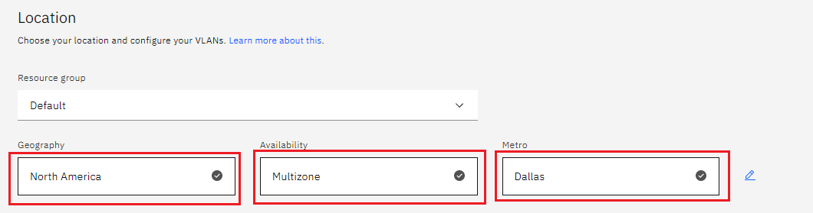

# Get Apache on IBM Cloud

[IBM Cloud] offers the most open and secure public cloud for business . You should have an IBM Cloud account, otherwise you can [register here].
At the end of the tutorial you will have a cluster with an Apache up and runnning.

1. We will provision a new Kubernetes Cluster for you if ,you already have one skip to step **2**
2. We will deploy  the IBM Cloud Block Storage plug-in ,if already have it skip to step **3**
3. Apache deployment 

## Step 1 provision Kubernetes Cluster

* Click the **Catalog** button on the top 
* Select **Service** from the catalog
* Search for **Kubernetes Service** and click on it

* You are now at the Kubernetes deployment page ,you need to specify some details about the cluster 
  - Choose **classic** or **VPC** 
 
  - Choose **Geography** (continent)
  - Choose **Single** or **Multizone** 
  - Choose **Worker Zone** (city)
  
 
  - Choose a **Worker node setup** or use the preselected one , set **Worker node amount per zone**

  - Give cluster a **name** 
  - Click **Create** - it will take approximately 10-20 minutes to provision the cluster


## Step 2 deploy IBM Cloud Block Storage plug-in
The Block Storage plug-in is a persistent, high-performance iSCSI storage that you can add to your apps by using Kubernetes Persistent Volumes (PVs).
 
* Click the **Catalog** button on the top 
* Select **Software** from the catalog
* Search for **IBM Cloud Block Storage plug-in** and click on it


* On the application page Click in the _dot_ next to the cluster , you wish to use
* Click on  **Enter or Select Namespace** and choose the default Namespace or use a custom one 

* Give a **name** to this workspace 
* Click **install** and wait for the deployment

 

## Step 3 deploy Apache
  
We will deploy  Apache on our cluster 
  
* Click the **Catalog** button on the top 
* Select **Software** from the catalog
* Search for **Apache** and click on it


* On the application page Click in the _dot_ next to the cluster , you wish to use

* Click on  **Enter or Select Namespace** and choose the default Namespace or use a custom one 

* Give a unique **name** to workspace , which you can easily recognize

* After finishing everything , **tick** the box next to the agreements and click **install**


## Verify Apache installation

* Go to [Resources] in your browser 
* Click on **Clusters**
* Click on your Cluster


* Now you are at you clusters overview ,here Click on **Actions** and **Web terminal** from the dropdown menu

* Click **install** - wait couple of minutes 
* Click on **Actions**
* Click **Web terminal** --> a terminal will open up

* **Type** in the terminal:
 ```sh
$ kubectl get service --all-namespaces
```

* Running Apache service will be visible 
* Copy the **External ip** , you can access the website on this IP
* Paste it into your browser
* Apache welcome message will be visible


You successfully deployed an Apache webserver on IBM Cloud ! 


 
   [IBM Cloud]: <http://cloud.ibm.com>
   [Resources]: <http://cloud.ibm.com/resources>
   [Register Here]: <http://cloud.ibm.com/registration>
